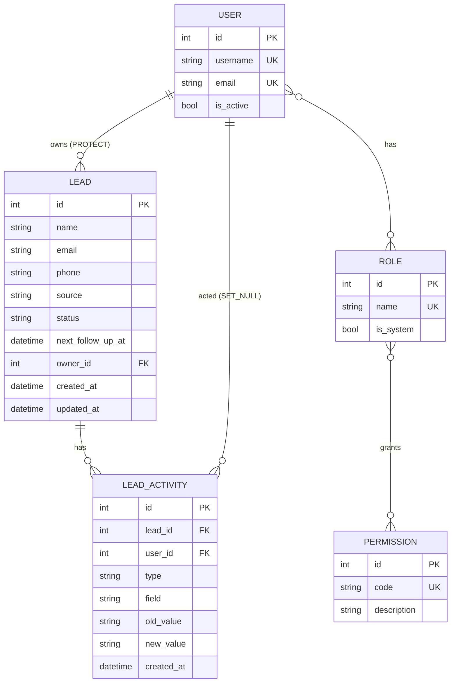

# Architecture

## Overview

Pipely is split into a **Django REST Framework** backend (`backend/`) and a
**React + TypeScript** frontend (`frontend/`). The backend owns all business rules
and access control; the frontend is a thin SPA that renders state and hides actions
the user can't perform — but never enforces anything itself.

## Repository structure

```
backend/
├── config/                 # project config
│   ├── config.py           # single place that reads env vars
│   ├── settings/           # base.py / dev.py / prod.py
│   ├── urls.py             # /admin, /api/v1/*, Swagger
│   └── wsgi.py · asgi.py
└── apps/
    ├── core/               # shared utilities, NO domain models
    │   ├── exceptions.py   # unified error envelope + Conflict / DuplicateLead
    │   ├── pagination.py   # { data, meta } envelope
    │   ├── permissions.py  # HasActionPermission (generic RBAC check)
    │   └── models.py       # TimeStampedModel (abstract)
    ├── users/              # auth, profile, users management AND RBAC
    │   ├── models/         # user.py, role.py, permission.py
    │   ├── serializers/ · views/ · urls/
    │   ├── migrations/     # includes the seed_roles_permissions data migration
    │   └── management/commands/  # assign_role, seed_demo
    └── leads/              # the lead domain
        ├── models/         # lead.py (+ LeadQuerySet), lead_activity.py, choices.py
        ├── rules.py        # CLOSED_STATUSES, stale_cutoff() — shared rule source
        ├── services/       # lead.py, phone.py, duplicates.py, assignment.py, activity.py
        ├── serializers/ · views/ · urls/
        └── filters.py

frontend/src/
├── api/        # axios client (401 → refresh), auth.ts, leads.ts, users.ts
├── auth/       # AuthContext, ProtectedRoute
├── hooks/      # useDebounce, useLeadParams (URL sync), usePermissions
├── lib/        # types, tokens, format, errors, leadMeta, activity
├── components/ # AppLayout, Sidebar, Modal, Popover, Toast, leads/*, settings/*
└── pages/      # Login, Register, Leads, LeadDetail, Dashboard, Settings, 404, 403
```

Each Django app follows a **package layout**: code-heavy modules (`models`,
`serializers`, `views`, `urls`) are folders with one file per concern, re-exported
from `__init__.py`. Small modules (`admin.py`, `apps.py`, `filters.py`) stay single
files.

## Settings

`config/config.py` reads every environment variable **once** into typed constants;
the settings modules only consume those constants (no scattered `os.getenv`).
Settings are split into:

- `base.py` — shared config
- `dev.py` — `DEBUG=True`, permissive hosts (used by `manage.py`)
- `prod.py` — `DEBUG=False`, HSTS/SSL hardening (used by `wsgi.py` / `asgi.py`)

## API versioning

All endpoints live under **`/api/v1/`**. The version is a URL prefix so the routes
can evolve without breaking existing clients; the frontend's axios `baseURL` points
at `/api/v1`.

## Data model



Constraints & indexes on `LEAD`: a `CheckConstraint` requiring email or phone;
company-wide partial `UniqueConstraint`s on `phone` and `Lower(email)`; indexes on
`status`, `created_at`, `updated_at`, `next_follow_up_at`, `owner`.

## Access control layers

A request passes through, in order:

1. **Authentication (401)** — JWT (`IsAuthenticated` global default). Public:
   register, login, refresh, Swagger.
2. **Action permission (403)** — `HasActionPermission` reads the view's
   `required_permissions` (HTTP-method → permission-code map) and checks
   `user.get_permission_codes()`. **Anything not mapped is denied by default.**
3. **Data scope (404)** — querysets are filtered by `Lead.objects.visible_to(user)`:
   all leads with `leads.view_all`, otherwise only the user's own. A lead outside the
   scope is a **404**, never a 403 (we don't reveal it exists).
4. **Throttling (429)** — `ScopedRateThrottle` on login/register (`auth: 5/min`) and
   `UserRateThrottle` on the API (`user: 1000/hour`); surfaced as `rate_limited`.

## Key decisions & tradeoffs

- **Custom user model from the start** — avoids a painful swap later; adds unique
  email and a `roles` M2M.
- **RBAC lives in `users`, not a separate app or `core`** — roles belong to the user
  domain, exactly like Django keeps `User`/`Group`/`Permission` together. `core` stays
  a small utility layer with no domain models. `HasActionPermission` sits in `core`
  only because every app uses it, and it only calls `user.get_permission_codes()`, so
  `core` never imports `users` models.
- **Permissions bound to actions, not URLs** — URLs change, permission codes stay
  stable. Deny-by-default means a new endpoint is locked until it declares a code.
- **403 vs 404** — missing permission is a 403; a lead outside your data scope is a
  404. Scope is enforced by queryset filtering, so "not yours" is indistinguishable
  from "doesn't exist".
- **Service layer** — create/update/status/assign write their `LeadActivity` rows
  inside `transaction.atomic()` in `leads/services/`, keeping views thin.
- **`LeadQuerySet` as the single source of truth for lead states** — `open`,
  `overdue`, `due_today`, `upcoming`, `stale`, `visible_to`. Filters, stats and views
  all call these, so the dashboard numbers and the filtered list can never disagree.
- **`rules.py` shared by the queryset and the model properties** — `CLOSED_STATUSES`
  and `stale_cutoff()` live in one module that both `LeadQuerySet` and the `Lead`
  properties import.
- **Properties, not annotations, for `is_stale` / `is_overdue`** — they read only
  fields already loaded on the row (`status`, `updated_at`, `next_follow_up_at`), so
  there are no extra queries and no N+1, and — unlike queryset annotations — they also
  work on the freshly-saved instance returned by create/update responses (no re-fetch).
  A **consistency test** asserts `lead.is_stale == Lead.objects.stale().filter(pk=lead.pk).exists()`
  (and the same for `is_overdue`) across a mix of leads, guarding against the SQL and
  Python definitions drifting apart.
- **`APIView` everywhere, never ViewSets** — explicit request handling keeps full
  control over each action; main serializers subclass the base `Serializer` (not
  `ModelSerializer`) for the same reason.
- **DB constraints + serializer validation** — the serializer returns a friendly 400/409
  first; the DB `CheckConstraint`/`UniqueConstraint` is the race-safe net (an
  `IntegrityError` is mapped back to a 409).
- **Company-wide duplicates** — because Managers see all leads, duplicate detection is
  company-wide (email case-insensitive, phone normalized), not per-owner.
- **Phone normalization** — spaces/dashes/parentheses stripped, a leading `+` kept, so
  `+998 90 123-45-67` is stored as `+998901234567` and compared reliably.
- **Follow-ups and stale are derived state, computed at query time** — nothing is
  stored and no background job runs. A stale lead is open, untouched for
  `STALE_LEAD_DAYS`, and has no future follow-up (a planned follow-up means it isn't
  forgotten). Any save bumps `updated_at` and clears the stale state automatically.
- **Follow-up cleared on won/lost** — a closed lead needs no follow-up; the change is
  logged as an activity.
- **N+1 prevention** — `select_related("owner")` on lead querysets;
  `prefetch_related` for roles/users where lists are returned.
- **JWT in localStorage** — simple and keeps the API stateless (no CSRF). Tradeoff:
  readable by JS, so vulnerable to XSS. Accepted for this project; a refresh-token
  cookie would be the hardened alternative.
- **No Celery/Redis** — there are no background tasks: time-based states (overdue,
  today, stale) are computed at query time, and indexes + pagination keep it fast.

## Future improvements

- Follow-up and stale **reminders** via email/Telegram (Celery + Celery Beat + Redis).
- **Redis cache** for stats, and a shared cache for throttling once there are multiple
  workers (the default LocMem cache is per-process).
- Per-role or per-team **stale thresholds**.
- Avatar upload, email verification, 2FA.
- **Audit log** for RBAC changes.
- Production serving with **gunicorn + WhiteNoise/collectstatic** (the Docker setup
  currently runs Django's dev server for convenience) and CI.
